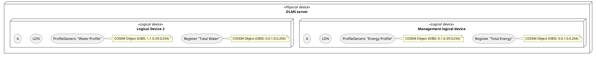
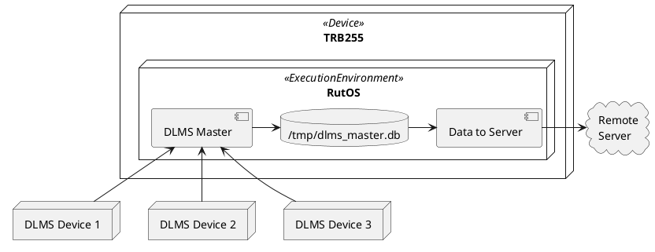
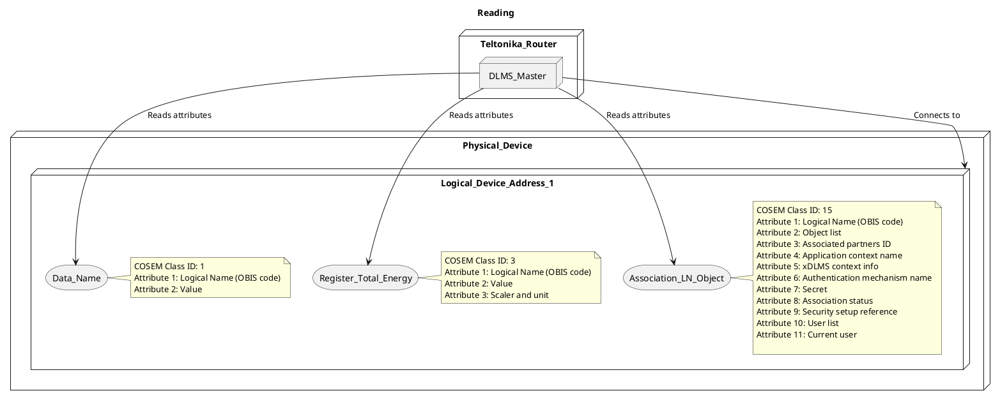
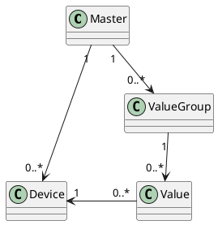
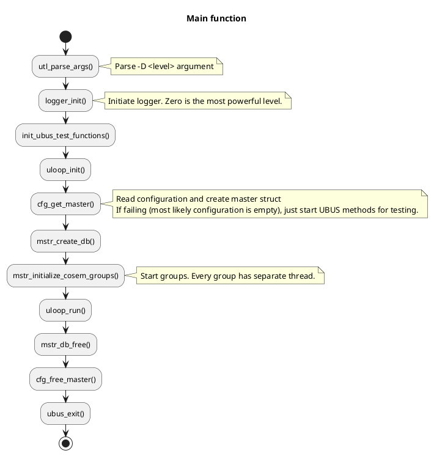
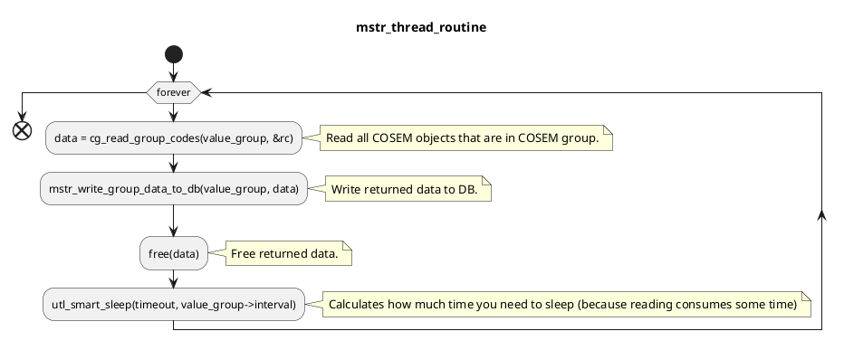

# DLMS Master

Master type application for DLMS supported device (server) interval scanning. Application itself is more like a client since it connects to DLMS device(s) also known as server and collects data by given OBIS code.

### DLMS Device

Each **physical device** can contain one or more **logical devices**. Each **logical device** contains a number of **COSEM** objects, modeling the functionality of the **logical device**.

COSEM objects are implemented from COSEM interface classes which describe attributes and methods of realised COSEM objects.
Each COSEM objects is identified by it's OBIS code: A.B.C.D.E.F (0.0.1.0.0.254)

### Deployment diagram

### Overview what DLMS Master application reads and connects to

### Class diagram

### Main function activity diagram

#### Thread routine

### DLMS/COSEM message types

| Frame | Description |
| ------ | ------ |
| SNRM | Set Normal Response Mode, is used to bring the server (meter) into the normal response mode. The SNRM is used to negotiate parameters such as the maximum length of the data that can be received and transmitted by either party |
| UA | On reception of an SNRM, the server examines the values of these parameter (if sent by the client) and chooses a value which both the client and server will be compliant to. This information is conveyed by the server to the client using a UA Frame. |
| AARQ | Application Association Request, is sent by the client to establish an association with the server. The AARQ PDU (Protocol Data Unit) communicates the Application Context used and the Authentication Value (Secret Password to authenticate Client and/or Server) if any to the Server. |
| AARE | Application Association Response, is the response sent by the server to an AARQ. |
| GET | A GET request is used by the client to fetch data from the meter. |
| SET | The SET Request is used by the client to set a data at the meter. |
| DISC | Disconnect – command is used to disconnect the logical link layer of the client from the server. On reception of a DISC command, the server responds with a UA, similar to the one sent on response to the SNRM. The server is said to be in NDM (Normal Disconnected Mode) on reception of this command. No data exchange can be carried out in this state, except Unnumbered Information and Mode Setting Command such as the SNRM. |

### Connecting and reading 

In order to connect to DLMS device, we need: 
- server address 
- client address 
- TCP IP/PORT or serial port. 

DLMS devices have multiple levels of authentications which grant different permissions to physical device. 
Different authentications use different client address (default: no authentication 16, low (password only) - 17, high (password + encryption) - 18)

## Test button

Test button should be working **after** you enable master section.

We can test:
1. Physical device;
2. COSEM group. If we want to test COSEM group, **at least** one physical device must be created.

Test buttons can be tested through UBUS calls:

* TCP device:
`ubus call dlms test_device '{"type":0, "tcp_address":"192.168.1.156", "tcp_port":4068,"client_addr":16,"logical_server_addr":0, "server_addr":1, "security":0}'`

* Serial device:
`ubus call dlms test_device '{"type":1, "serial_dev":"/dev/rs232", "serial_baudrate":9600, "serial_databits":8, "serial_stopbits":1, "serial_parity":"none", "serial_flowcontrol":"none", "client_addr":16,"logical_server_addr":0, "server_addr":1, "security":0}'`

* COSEM group:
`ubus call dlms test_cosem_group '{"objects":[{"id":5, "enabled":1, "name":"type_data", "devices":["4","3","6","10"], "obis":"0.0.42.0.0.255", "cosem_id":1}]}'`

## Configurations 

**Config**: dlms_master
**Config Section**: connection

| Option label | Option hint |  Placeholder | Option validation | Option name in config | Default values | Required |
| ------ | ------ | ------ | ------ | ------ |------ | ------ |
| Name |  Name of DLMS connection configuration | - | - | name | - | Yes |
| Connection type  | DLMS connection type | - | drowdown selection TCP or SERIAL | type | TCP | Yes |

**Connection type: TCP**

| Option label | Option hint |  Placeholder | Option validation | Option name in config | Default values | Required |
| ------ | ------ | ------ | ------ | ------ |------ | ------ | 
| Address | DLMS device IP address for TCP connection | - | IP address validation | address | - | Yes |
| Port | DLMS device IP port for TCP connection | - | 0-65535 | port | - | Yes |

**Connection type: TCP**

| Option label | Option hint |  Placeholder | Option validation | Option name in config | Default values | Required |
| ------ | ------ | ------ | ------ | ------ |------ | ------ | 
| Serial device | DLMS device serial device | - | drowdown selection from /dev/* | device | - | Yes |
| Baudrate | Serial port baudrate | - | 300/600/1200/1800/2400/4800/9600/19200/38400 | baudrate | 9600 | Yes |
| Databits | Serial port databits | - | 5/6/7/8 | databits | 8 | Yes |
| Stopbits | Serial port stopbits | - | 1/2 | stopbits | 1 | Yes |
| Parity | Serial port parity | - | None/Even/Odd/Mark/Space | parity | None | Yes |
| Flow control | Serial port parity | - | None, RTS/CTS, Xon/Xoff | flowcontrol | None | Yes |

**Config**: dlms_master
**Config Section**: physical_device

| Option label | Option hint |  Placeholder | Option validation | Option name in config | Default values | Required |
| ------ | ------ | ------ | ------ | ------ |------ | ------ | 
| Enabled | Physical device state | - | 1/0 | enabled | 0 | Yes |
| Name | Physical device name | - | - | name | 9600 | Yes |
| Server address | DLMS device server address | - | Numbers only | server_addr | None | Yes |
| Logical server address | DLMS device logical server address | - | Numbers only | server_addr | None | Yes |
| Client address | DLMS device client address | - | Numbers only | client_addr | 8 | Yes |
| Access security | DLMS device authentication type | - | (0) NONE / LOW (1) / HIGH (2) / HIGH MD5 (3) / HIGH SHA1 (4) / HIGH GMAC (5) | authentication | 0 | Yes |
| Interface type | DLMS device interface type | - | (0) HDLC / WRAPPER (1) | interface | 0 | Yes |
| Transport security | DLMS device security | - | 0 (NONE) / Authentication (16) / Security encryption (32) / Authentication encryption (48) | security | 0 | Yes |
| Password | DLMS device password if authentication is used | - | - | password | - | No |
| Authentication key | DLMS device authentication key | - | - | authentication_key | - | No |
| Block cipher key | DLMS device block cipher key | - | - | block_cipher_key | - | No |
| Dedicated key | DLMS device dedicated key | - | - | dedicated_key | - | No |
| Invocation counter OBIS code | DLMS device invocation counter OBIS | - | - | dedicated_key | - | No |

**Config**: dlms_master
**Config Section**: cosem_group

| Option label | Option hint |  Placeholder | Option validation | Option name in config | Default values | Required |
| ------ | ------ | ------ | ------ | ------ |------ | ------ | 
| Enabled | Value group state | - | 1/0 | enabled | - | Yes |
| Name | OBIS code group name | - | - | name | - | Yes |
| Interval | Interval for OBIS code reading | - | Numbers only | interval | - | Yes |

**Config**: dlms_master
**Config Section**: cosem

| Option label | Option hint |  Placeholder | Option validation | Option name in config | Default values | Required |
| ------ | ------ | ------ | ------ | ------ |------ | ------ | 
| Enabled | OBIS state | - | 1/0 | enabled | - | Yes |
| Name | OBIS option name | - | - | name | - | Yes |
| Physical devices | Physical device to read from | - | select physical devices from dropdown and write it's section id | dev_config | - | Yes |
| OBIS Code | OBIS code value | - | - | code | - | Yes |
| COSEM class id | Object type for OBIS code | - | check 1. below | type | - | No (only if physical device option scanAllObjs is selected) |

1. Available COSEM class id

| Class name | class ID |
| ------ | ------ | 
| DATA | 1 |
| REGISTER | 3 |
| EXTENDED REGISTER | 4 |
| DEMAND REGISTER | 5 |
| REGISTER ACTIVATION | 6 |
| PROFILE GENERIC | 7 |
| CLOCK | 8 |
| SCRIPT TABLE | 9 |
| SPECIAL DAYS TABLE | 11 |
| ASSOCIATION SHORT NAME | 12 |
| ASSOCIATION LOGICAL NAME | 15 |
| SAP ASSIGNMENT | 17 |
| IMAGE TRANSFER | 18 |
| IEC LOCAL PORT SETUP | 19 |
| ACTIVITY CALENDAR | 20 |
| REGISTER MONITOR | 21 |
| ACTION SCHEDULE | 22 |
| IEC HDLC SETUP | 23 |
| IEC TWISTED PAIR SETUP | 24 |
| UTILITY TABLES | 26 |
| MODEM CONFIGURATION | 27 |
| AUTO ANSWER | 28 |
| AUTO CONNECT | 29 |
| PUSH SETUP | 40 |
| TCP UDP SETUP | 41 |
| IP4 SETUP | 42 |
| MAC ADDRESS SETUP | 43 |
| GPRS SETUP | 45 |
| GSM DIAGNOSTIC | 47 |
| IP6 SETUP | 48 |
| COMPACT DATA | 62 |
| SECURITY SETUP | 64 |
| DISCONNECT CONTROL | 70 |
| LIMITER | 71 |
